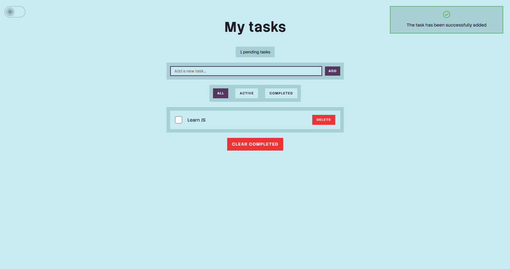
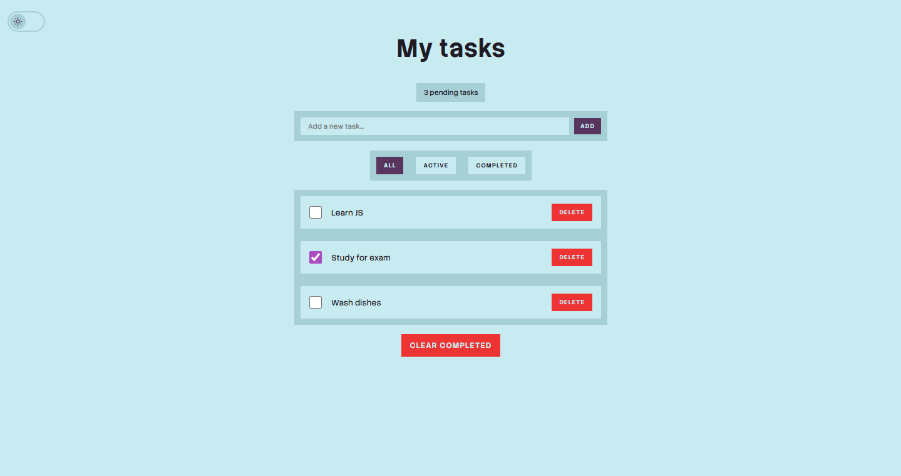
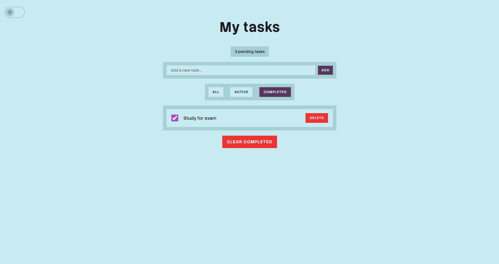
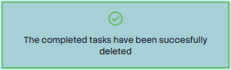
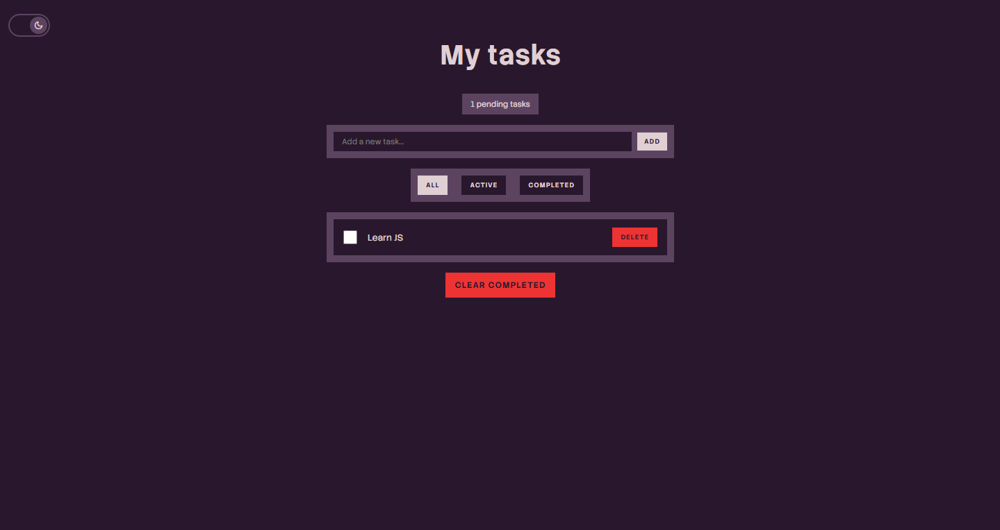

# Todo App

Interactive to-do list web application (To-Do App) built from scratch with HTML, CSS and JavaScript

## Screenshots







## Content Table

* [Features](#features)
* [Demo](#demo)
* [Technologies used](#technologies-used)
* [Tests](#tests)
* [Installation](#installation)
* [Usage](#usage)
* [Key Learnings](#key-learnings)
* [Author](#author)
* [Licence](#license)

## Features

* ✅ Add and delete tasks
* 🔄 Toggle task completion
* 🔍 Filter tasks (All / Active / Completed)
* 💾 Data persistence with localStorage
* 🌓 Dark mode support
* 📱 Fully responsive design

## Demo


## Technologies Used

* HTML5
* CSS3
* JavaScript (ES6+)
* Local Storage API

## Tests

The project uses Jasmine framework to include around 30 tests to verify the app's reliability.

The tests cover the following functionalities:

* Add an delete tasks
* Clear the completed tasks
* Toggle filter
* Toggle theme
* Show notifications

## Installation

1. Clone the repository
```bash
git clone https://github.com/JesusHM0406/todo-web-app.git
```

2. Open `index.html` in your browser

That's it! No build process required.

## Usage

* **Add Task**: Type in the input field and press Enter or click "Add"
* **Complete Task**: Click the checkbox next to a task
* **Delete Task**: Click the "Delete" button
* **Filter Tasks**: Use the All/Active/Completed buttons
* **Dark Mode**: Click the moon/sun icon in the top-left

## Key Learnings

* DOM manipulation and event handling
* Working with LocalStorage API
* State management in JS
* Responsive design principles
* Array methods (map, filter, reduce)

## Author

**Jesus Hernandez**
* GitHub: [@JesusHM0406](https://github.com/JesusHM0406)

## License

This project is open source and available under the [MIT License](LICENSE).
